# Diagramme des Cas d'Utilisation (Use Case Diagram)

## Présentation

Ce document décrit les interactions entre les utilisateurs du système **Ice Facture** et les fonctionnalités proposées. L'application met en œuvre un contrôle d'accès basé sur les rôles (**RBAC** - Role-Based Access Control) distinguant l'**Administrateur (Gérant)** et l'**Employé (Vendeur)**, tout en intégrant des mécanismes automatiques de synchronisation PWA hors-ligne.

---

## Diagramme UML des Cas d'Utilisation

```mermaid
graph TD
    %% Acteurs
    Admin(("Administrateur<br>(Gérant)"))
    Employee(("Employé<br>(Vendeur)"))
    SystemSync(("Service Worker<br>(Sync PWA)"))

    %% Héritage des rôles
    Employee --> Admin

    subgraph IceFactureSystem [" Application Ice Facture "]
        
        %% Authentification & Sécurité
        subgraph AuthModule ["Authentification & Sécurité"]
            UC_Login["Se connecter"]
            UC_Register["S'inscrire (Admin initial)"]
            UC_ResetPwd["Réinitialiser mot de passe (Email)"]
            UC_VerifyAdminPwd["Valider mot de passe Admin (Opérations critiques)"]
        end

        %% Point de Vente & Caisse
        subgraph POSModule ["Point de Vente (POS) & Encaissement"]
            UC_POS["Effectuer une vente au comptoir"]
            UC_Scan["Scanner code-barres (Caméra / USB)"]
            UC_SearchProd["Rechercher produit par désignation/code"]
            UC_Calc["Utiliser la calculatrice intégrée"]
            UC_PrintReceipt["Imprimer ticket de caisse (80mm)"]
            UC_GenPDF["Générer facture PDF (A4) avec QR Code"]
            UC_ManageDebt["Gérer dette client (Paiement partiel / Acompte)"]
        end

        %% Inventaire
        subgraph StockModule ["Gestion des Produits & Inventaire"]
            UC_ViewStock["Consulter le catalogue & état des stocks"]
            UC_AddStock["Ajouter / Mettre à jour produit (Upsert)"]
            UC_DeleteProd["Supprimer un article du stock"]
        end

        %% Finances & Charges
        subgraph FinanceModule ["Suivi Financier & Charges"]
            UC_AddExpense["Enregistrer une dépense (Loyer, Salaire, etc.)"]
            UC_ViewExpenses["Consulter le journal des charges"]
            UC_DeleteExpense["Supprimer une dépense"]
            UC_Dashboard["Consulter le Tableau de Bord (Ventes, Marge Nette)"]
        end

        %% Gestion des Équipes & Boutique
        subgraph AdminModule ["Configuration & Gestion Équipe"]
            UC_CreateEmployee["Créer un compte Employé"]
            UC_ListEmployees["Consulter / Supprimer comptes Employés"]
            UC_ConfigShop["Configurer les coordonnées & Pied de page"]
        end

        %% Hors-Ligne & Sync
        subgraph OfflineModule ["PWA & Synchronisation"]
            UC_OfflineStore["Stockage local des transactions (Offline)"]
            UC_AutoSync["Synchronisation automatique au retour du réseau"]
        end

    end

    %% Relations Acteur -> Cas d'Utilisation
    Admin --> UC_Register
    Admin --> UC_CreateEmployee
    Admin --> UC_ListEmployees
    Admin --> UC_ConfigShop
    Admin --> UC_AddStock
    Admin --> UC_DeleteProd
    Admin --> UC_AddExpense
    Admin --> UC_ViewExpenses
    Admin --> UC_DeleteExpense
    Admin --> UC_Dashboard
    Admin --> UC_VerifyAdminPwd

    Employee --> UC_Login
    Employee --> UC_ResetPwd
    Employee --> UC_POS
    Employee --> UC_ViewStock
    Employee --> UC_ManageDebt

    %% Inclusion et Extension
    UC_POS -. "<<include>>" .-> UC_Scan
    UC_POS -. "<<include>>" .-> UC_SearchProd
    UC_POS -. "<<extend>>" .-> UC_PrintReceipt
    UC_POS -. "<<extend>>" .-> UC_GenPDF
    UC_POS -. "<<extend>>" .-> UC_Calc

    UC_DeleteProd -. "<<include>>" .-> UC_VerifyAdminPwd
    UC_AddStock -. "<<extend>>" .-> UC_VerifyAdminPwd

    SystemSync --> UC_OfflineStore
    SystemSync --> UC_AutoSync
```

---

## Spécification Détaillée des Cas d'Utilisation

### 1. Module Authentification & Gestion des Comptes

| ID | Cas d'Utilisation | Acteurs Principaux | Description & Règles Métier |
| :--- | :--- | :--- | :--- |
| **UC-01** | Se Connecter | Admin, Employé | Saisie email/téléphone et mot de passe. Émission d'un token JWT valide pour la session. |
| **UC-02** | Créer un Compte Employé | Administrateur | L'administrateur crée un accès restreint rattaché à son établissement (`parentId`). L'employé ne peut pas voir le chiffre d'affaires global ni ajouter/supprimer de stock sans autorisation. |
| **UC-03** | Validation Mot de Passe Admin | Administrateur | Requis avant l'exécution d'une suppression d'article, l'ajustement de prix ou l'annulation d'une facture pour prévenir les erreurs et fraudes. |

### 2. Module Point de Vente (POS) & Encaissement

| ID | Cas d'Utilisation | Acteurs Principaux | Description & Règles Métier |
| :--- | :--- | :--- | :--- |
| **UC-04** | Effectuer une Vente | Admin, Employé | Sélection visuelle d'articles ou via scanner code-barres. Calcul automatique du total, saisie du montant versé et déduction du reste à payer. |
| **UC-05** | Gestion des Dettes Clients | Admin, Employé | Si `Montant Versé < Total`, la facture bascule au statut `Dette`. Le système permet le règlement ultérieur des reliquats avec historique d'acompte (`PATCH /invoices/:id/pay`). |
| **UC-06** | Impression & Génération Document | Admin, Employé | Impression thermique instantanée (format 80mm) ou génération PDF A4 avec QR Code d'authenticité intégrant l'identifiant unique et l'horodatage. |

### 3. Module Inventaire & Produits

| ID | Cas d'Utilisation | Acteurs Principaux | Description & Règles Métier |
| :--- | :--- | :--- | :--- |
| **UC-07** | Upsert Produit | Administrateur | Lors de la saisie d'un nouveau produit, si le nom ou le code-barres existe déjà, la quantité est incrémentée automatiquement sur l'existant. |
| **UC-08** | Décrémentation de Stock | Système | Lors de la validation d'une facture, les quantités vendues sont décrémentées en temps réel. En cas d'annulation de vente par l'admin, le stock est réintégré. |

### 4. Module Suivi Financier & Charges

| ID | Cas d'Utilisation | Acteurs Principaux | Description & Règles Métier |
| :--- | :--- | :--- | :--- |
| **UC-09** | Enregistrement des Dépenses | Administrateur | Saisie des charges d'exploitation (Loyer, Salaire, Électricité, Logistique). |
| **UC-10** | Calcul Marge Nette | Administrateur | Calcul en temps réel sur le Dashboard : `Marge Nette = Chiffre d'Affaires Encaissé - Total Dépenses`. |

---

## Matrice de Traçabilité des Droits (RBAC)

| Fonctionnalité / Endpoint API | Admin | Employé | Remarques |
| :--- | :---: | :---: | :--- |
| Encaissement Vente (`POST /api/invoices`) | Oui | Oui | Accès Caisse autorisé pour tous |
| Consultation Historique (`GET /api/invoices`) | Oui | Oui | Employé voit les factures du shop |
| Règlement Dette (`PATCH /api/invoices/:id/pay`) | Oui | Oui | Permet d'encaisser les acomptes |
| Annulation Vente (`DELETE /api/invoices/:id`) | Oui | Non | Réservé Admin (Mot de passe requis) |
| Gestion Stock (`POST/DELETE /api/products`) | Oui | Non | Réservé Admin |
| Gestion Charges (`GET/POST/DELETE /api/expenses`) | Oui | Non | Réservé Admin |
| Gestion Équipe (`POST/DELETE /api/auth/employees`) | Oui | Non | Réservé Admin |
| Tableau de Bord / KPIs (`Dashboard`) | Oui | Non | Masqué pour les employés |
