# Diagramme de Classes et Modèle de Domaine (Class Diagram)

## Présentation

Ce document présente le **Diagramme de Classes** du projet **Ice Facture**, couvrant l'architecture objet du backend (Modèles Mongoose, Middlewares Express) et les abstractions logiques du frontend React (Composants, Service Clients, Custom Hooks et Utilitaires).

---

## Diagramme de Classes UML

```mermaid
classDiagram

    %% ==========================================
    %% BACKEND : MODÈLES DE DONNÉES (MONGOOSE)
    %% ==========================================
    class User {
        +ObjectId _id
        +String shopName
        +String email
        +String password
        +String address
        +String phone
        +String resetPasswordToken
        +Date resetPasswordExpires
        +String footerMessage
        +String role ["admin" | "employee"]
        +ObjectId parentId
        +Date createdAt
    }

    class Product {
        +ObjectId _id
        +ObjectId userId
        +String name
        +Number price
        +Number stock
        +String barcode
        +Date createdAt
    }

    class InvoiceItem {
        +ObjectId productId
        +String name
        +Number price
        +Number quantity
    }

    class Invoice {
        +ObjectId _id
        +ObjectId userId
        +String invoiceNumber
        +String customerName
        +String customerPhone
        +InvoiceItem[] items
        +Number totalAmount
        +Number amountPaid
        +Number remainingAmount
        +String status ["Payé" | "Dette"]
        +Date createdAt
        +preSaveHook()
    }

    class Expense {
        +ObjectId _id
        +ObjectId userId
        +String description
        +Number amount
        +String category ["Loyer" | "Électricité" | "Transport" | "Marchandise" | "Salaire" | "Autre"]
        +Date date
        +Date createdAt
    }

    %% ==========================================
    %% BACKEND : MIDDLEWARES & CONTROLES
    %% ==========================================
    class AuthMiddleware {
        +authenticateToken(req, res, next)
        +resolveOwnerId(req)
    }

    class ValidateMiddleware {
        +validateSchema(schema)
    }

    class AuthController {
        +register(req, res)
        +login(req, res)
        +getProfile(req, res)
        +updateProfile(req, res)
        +updatePassword(req, res)
        +createEmployee(req, res)
        +getEmployees(req, res)
        +deleteEmployee(req, res)
        +verifyPassword(req, res)
        +forgotPassword(req, res)
        +resetPassword(req, res)
        +deleteAccount(req, res)
    }

    class ProductController {
        +getProducts(req, res)
        +upsertProduct(req, res)
        +deleteProduct(req, res)
    }

    class InvoiceController {
        +getInvoices(req, res)
        +getCustomers(req, res)
        +createInvoice(req, res)
        +payRemainingAmount(req, res)
        +cancelInvoice(req, res)
    }

    class ExpenseController {
        +getExpenses(req, res)
        +createExpense(req, res)
        +deleteExpense(req, res)
    }

    %% ==========================================
    %% FRONTEND : UTILS, HOOKS & COMPOSANTS
    %% ==========================================
    class ApiClient {
        +AxiosInstance instance
        +String baseURL
        +setAuthHeader(token)
        +get(url, config)
        +post(url, data, config)
        +put(url, data, config)
        +patch(url, data, config)
        +delete(url, config)
    }

    class UseOfflineSync {
        +Boolean isOnline
        +Array pendingInvoices
        +saveInvoiceOffline(invoiceData)
        +syncPendingInvoices()
    }

    class PDFGenerator {
        +generateInvoicePDF(invoice, shopInfo)
        +downloadPDF(doc, filename)
    }

    class ReceiptComponent {
        +Invoice invoiceData
        +ShopInfo shopData
        +renderThermalReceipt()
    }

    class CalculatorComponent {
        +String displayValue
        +handleKeyPress(key)
        +calculateResult()
    }

    %% ==========================================
    %% RELATIONS ET COMPOSITIONS
    %% ==========================================
    User "1" <-- "0..*" User : Employés (parentId)
    User "1" -- "0..*" Product : possède (userId / ownerId)
    User "1" -- "0..*" Invoice : émet (userId / ownerId)
    User "1" -- "0..*" Expense : comptabilise (userId / ownerId)
    Invoice "1" *-- "1..*" InvoiceItem : contient
    Product "0..1" -- "0..*" InvoiceItem : référencé dans

    AuthController ..> User : manipule
    AuthController ..> AuthMiddleware : sécurisé par
    ProductController ..> Product : manipule
    ProductController ..> AuthMiddleware : sécurisé par
    InvoiceController ..> Invoice : manipule
    InvoiceController ..> Product : met à jour le stock
    InvoiceController ..> AuthMiddleware : sécurisé par
    ExpenseController ..> Expense : manipule
    ExpenseController ..> AuthMiddleware : sécurisé par

    UseOfflineSync ..> ApiClient : synchronise via
    ReceiptComponent ..> Invoice : affiche
    PDFGenerator ..> Invoice : convertit en PDF
```

---

## Description des Entités Principales

### 1. Entités Modèle Backend (Mongoose)

#### `User`
- **Rôle** : Représente la boutique cliente (compte Administrateur) ou un compte Employé rattaché.
- **Gestion Multi-tenant** : `parentId` lie l'employé à la boutique de l'administrateur. En cas de requête backend, `req.user.ownerId` prend la valeur de `parentId` si l'utilisateur est employé, garantissant la séparation étanche des données entre boutiques.

#### `Product`
- **Rôle** : Représente une référence en stock.
- **Règles d'Upsert** : Si un ajout de produit correspond à un nom ou code-barres déjà existant pour le même `ownerId`, les quantités sont fusionnées.

#### `Invoice` & `InvoiceItem`
- **Rôle** : Document de transaction financière (vente au comptoir ou facture).
- **Automatisme Mongoose (`preSaveHook`)** :
  $$\text{remainingAmount} = \max(0, \text{totalAmount} - \text{amountPaid})$$
  $$\text{status} = \begin{cases} \text{"Dette"} & \text{si } \text{remainingAmount} > 0 \\ \text{"Payé"} & \text{sinon} \end{cases}$$

#### `Expense`
- **Rôle** : Journal d'enregistrement des frais fixes et variables de l'entreprise.

---

### 2. Composants Utilitaires Frontend

#### `useOfflineSync` (Custom Hook)
- Écoute les événements réseau `online` et `offline`.
- Stocke les ventes créées hors-ligne dans le `localStorage` en cas de coupure.
- Lance la réconciliation automatique avec l'API `/api/invoices` dès que le réseau est rétabli.

#### `generatePDF` (Générateur PDF Client)
- S'appuie sur `jsPDF` et `jspdf-autotable` pour générer un document A4 vectoriel et téléchargeable.
- Intègre un QR Code contenant la signature d'authenticité de la facture.
