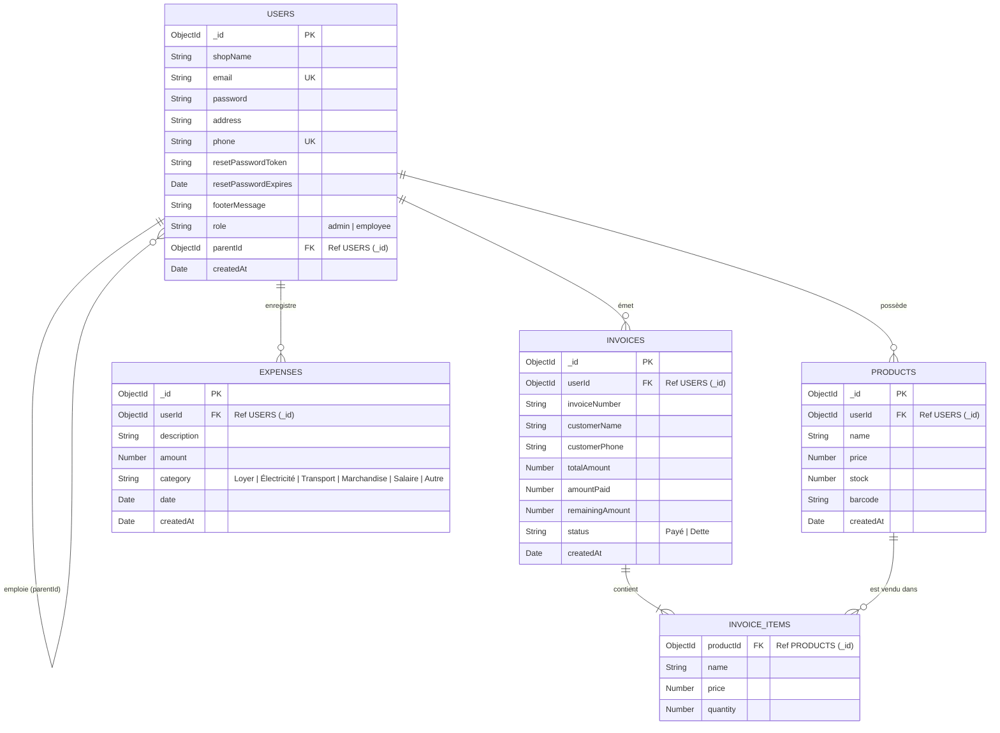

# Diagramme Entité-Association & Schéma de Base de Données (ERD)

## Présentation

Ce document spécifie le **modèle conceptuel et logique des données** de l'application **Ice Facture**. La base de données repose sur **MongoDB**, avec la modélisation objet fournie par **Mongoose**. Le système intègre un cloisonnement étanche des données (**Architecture Multi-tenant**) basé sur la clé de raccordement `userId` (ou `ownerId` pour les employés).

---

## Diagramme Entité-Association (Mermaid ERD)



---

## Dictionnaire de Données

### 1. Collection `users`

Contient les comptes propriétaires d'établissements (Administrateurs) et les comptes vendeurs rattachés (Employés).

| Champ | Type | Contraintes | Description |
| :--- | :--- | :--- | :--- |
| `_id` | `ObjectId` | PK, Auto | Identifiant unique de l'utilisateur |
| `shopName` | `String` | Required, Trim | Nom commercial de la boutique / établissement |
| `email` | `String` | Required, Unique, Lowercase | Adresse email (sert d'identifiant de connexion) |
| `password` | `String` | Required | Mot de passe haché par BcryptJS (salt rounds 8) |
| `address` | `String` | Default: `""` | Adresse physique de l'établissement |
| `phone` | `String` | Required, Unique, Trim | Numéro de téléphone unique de contact |
| `resetPasswordToken` | `String` | Optional | Jeton temporaire de réinitialisation de mot de passe |
| `resetPasswordExpires` | `Date` | Optional | Date d'expiration du jeton de réinitialisation |
| `footerMessage` | `String` | Default: `"Merci de votre confiance !"` | Message personnalisé sur les tickets/factures |
| `role` | `String` | Enum: `['admin', 'employee']` | Rôle de l'utilisateur dans l'application |
| `parentId` | `ObjectId` | FK (users._id), Default: `null` | Si role=`employee`, ID de l'Admin propriétaire |
| `createdAt` | `Date` | Default: `Date.now` | Horodatage de création du compte |

---

### 2. Collection `products`

Gère l'inventaire et les détails des articles en stock pour chaque boutique.

| Champ | Type | Contraintes | Description |
| :--- | :--- | :--- | :--- |
| `_id` | `ObjectId` | PK, Auto | Identifiant unique de l'article |
| `userId` | `ObjectId` | FK (users._id), Required | Identifiant de l'Admin propriétaire du stock |
| `name` | `String` | Required | Désignation ou libellé de l'article |
| `price` | `Number` | Required | Prix de vente unitaire en devise locale |
| `stock` | `Number` | Default: `0` | Quantité actuellement disponible en stock |
| `barcode` | `String` | Default: `""` | Code-barres unique EAN-13, UPC ou Code 128 |
| `createdAt` | `Date` | Default: `Date.now` | Horodatage de création de l'article |

---

### 3. Collection `invoices`

Consigne les transactions de vente au comptoir, factures et créances clients.

| Champ | Type | Contraintes | Description |
| :--- | :--- | :--- | :--- |
| `_id` | `ObjectId` | PK, Auto | Identifiant unique de la transaction |
| `userId` | `ObjectId` | FK (users._id), Required | Identifiant de la boutique émettrice |
| `invoiceNumber` | `String` | Required | Numéro unique généré (ex: `FACT-20260928-8472`) |
| `customerName` | `String` | Default: `"Client Passager"` | Nom ou prénom du client |
| `customerPhone` | `String` | Default: `""` | Téléphone du client (pour suivi des dettes) |
| `items` | `Array[Object]` | Embedded | Tableau des articles vendus |
| `totalAmount` | `Number` | Required | Montant total brut de la facture |
| `amountPaid` | `Number` | Default: `0` | Montant effectivement encaissé lors de la vente |
| `remainingAmount` | `Number` | Calculated | Solde restant dû ($totalAmount - amountPaid$) |
| `status` | `String` | Enum: `['Payé', 'Dette']` | État du règlement (`Dette` si $remainingAmount > 0$) |
| `createdAt` | `Date` | Default: `Date.now` | Horodatage de l'opération |

#### Sous-Schéma `items` (Embedded Document)
- `productId` : `ObjectId` (Référence vers `products._id`)
- `name` : `String` (Nom archivé au moment de la vente)
- `price` : `Number` (Prix unitaire appliqué lors de la vente)
- `quantity` : `Number` (Quantité achetée, min 1)

---

### 4. Collection `expenses`

Enregistre le journal comptable des frais et charges de fonctionnement.

| Champ | Type | Contraintes | Description |
| :--- | :--- | :--- | :--- |
| `_id` | `ObjectId` | PK, Auto | Identifiant unique de la dépense |
| `userId` | `ObjectId` | FK (users._id), Required | Identifiant de la boutique concernée |
| `description` | `String` | Required, Trim | Libellé ou motif du paiement |
| `amount` | `Number` | Required | Montant de la charge engagée |
| `category` | `String` | Enum: `['Loyer', 'Électricité', 'Transport', 'Marchandise', 'Salaire', 'Autre']` | Catégorisation de la charge |
| `date` | `Date` | Default: `Date.now` | Date effective de la dépense |
| `createdAt` | `Date` | Default: `Date.now` | Horodatage d'enregistrement |

---

## Intégrité et Isolation Multi-Tenants

Pour garantir qu'une boutique A ne puisse jamais accéder ou modifier les données d'une boutique B :
1. Chaque document (`Product`, `Invoice`, `Expense`) enregistre le `userId` de l'**Administrateur principal** (Propriétaire).
2. Le middleware d'authentification JWT décode le jeton de l'utilisateur actif et calcule automatiquement l'identifiant propriétaire :
   ```js
   req.user.ownerId = req.user.role === 'employee' ? req.user.parentId : req.user.id;
   ```
3. Toutes les requêtes Mongoose filtrent systématiquement les résultats par `{ userId: req.user.ownerId }`.
