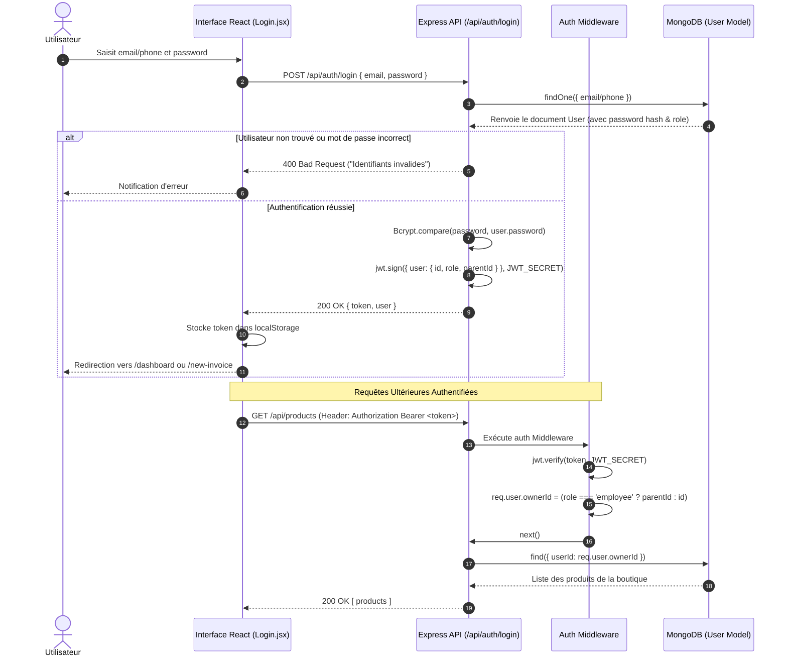
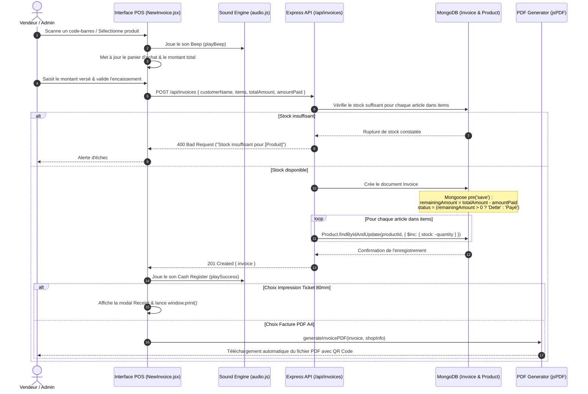
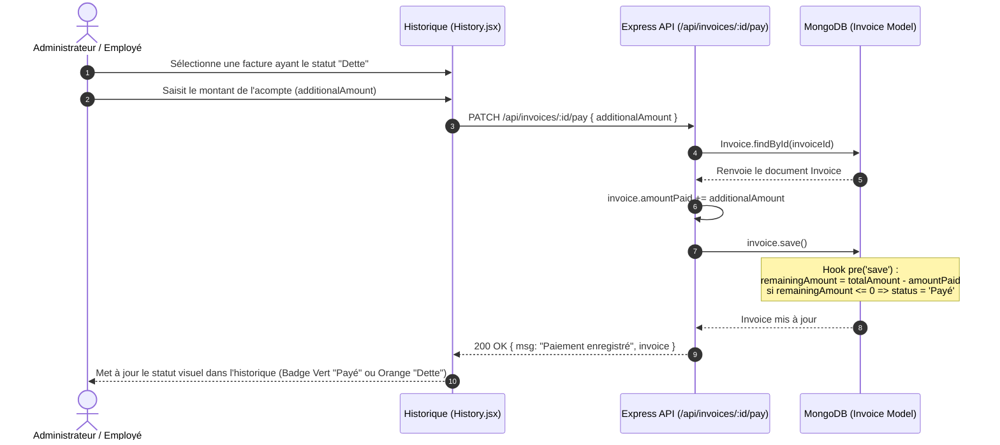
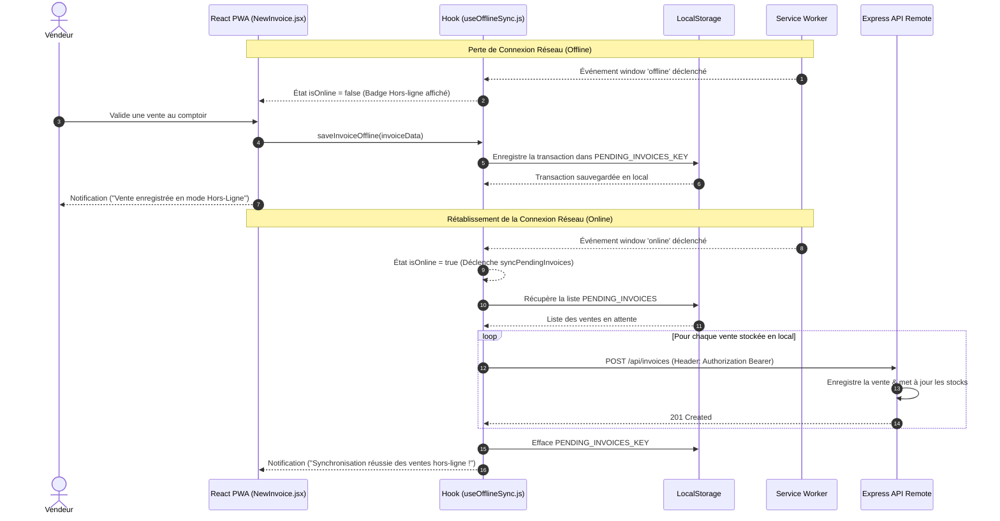

# Diagrammes de Séquence (Sequence Diagrams)

## Présentation

Ce document rassemble les **Diagrammes de Séquence** détaillant la dynamique des échanges d'information entre le Client (React 19 PWA), le Middleware de Sécurité, les Contrôleurs Express.js et la Base de Données MongoDB.

---

## Sommaire des Flux Traités

1. [Flux 1 : Authentification & Résolution Multi-Tenant (Login)](#flux-1--authentification--résolution-multi-tenant-login)
2. [Flux 2 : Vente au Comptoir (POS) & Décrémentation de Stock](#flux-2--vente-au-comptoir-pos--décrémentation-de-stock)
3. [Flux 3 : Recouvrement d'une Dette Client (Acompte)](#flux-3--recouvrement-dune-dette-client-acompte)
4. [Flux 4 : Vente Hors-Ligne & Synchronisation PWA (Offline First)](#flux-4--vente-hors-ligne--synchronisation-pwa-offline-first)

---

## Flux 1 : Authentification & Résolution Multi-Tenant (Login)

Ce flux décrit la connexion d'un utilisateur (Admin ou Employé), la génération du token JWT et la résolution de l'identifiant propriétaire (`ownerId`).

---

## Flux 2 : Vente au Comptoir (POS) & Décrémentation de Stock

Ce flux montre l'ajout d'articles par scan ou sélection, la validation de la vente, la mise à jour transactionnelle du stock et l'émission du document PDF / Ticket.

---

## Flux 3 : Recouvrement d'une Dette Client (Acompte)

Ce flux décrit le suivi et le règlement ultérieur d'un reliquat client sur une facture enregistrée avec le statut `Dette`.

---

## Flux 4 : Vente Hors-Ligne & Synchronisation PWA (Offline First)

Ce flux illustre le comportement du système lors d'une perte soudaine de la connexion Internet et sa réconciliation automatique.

