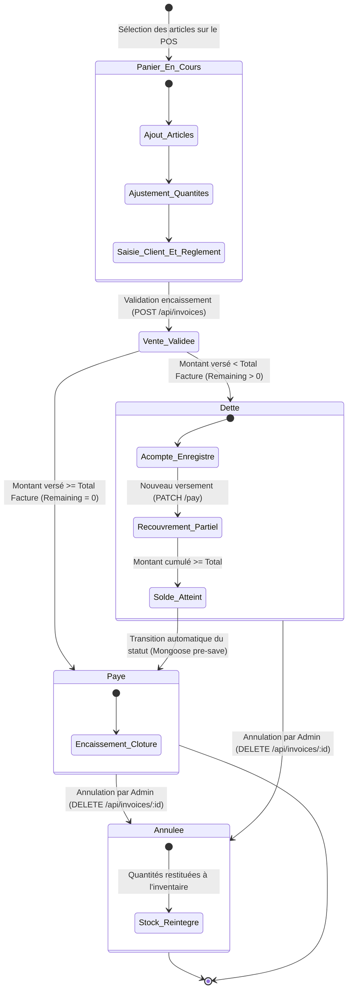
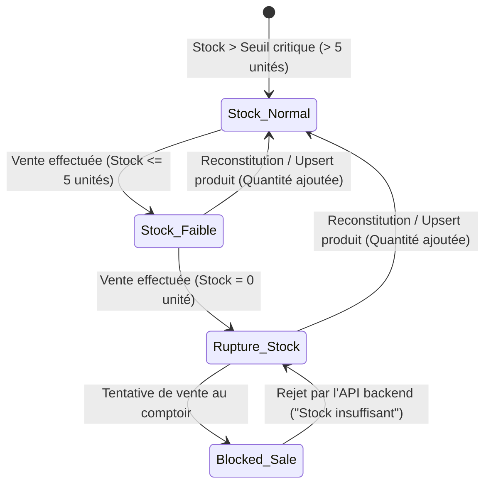
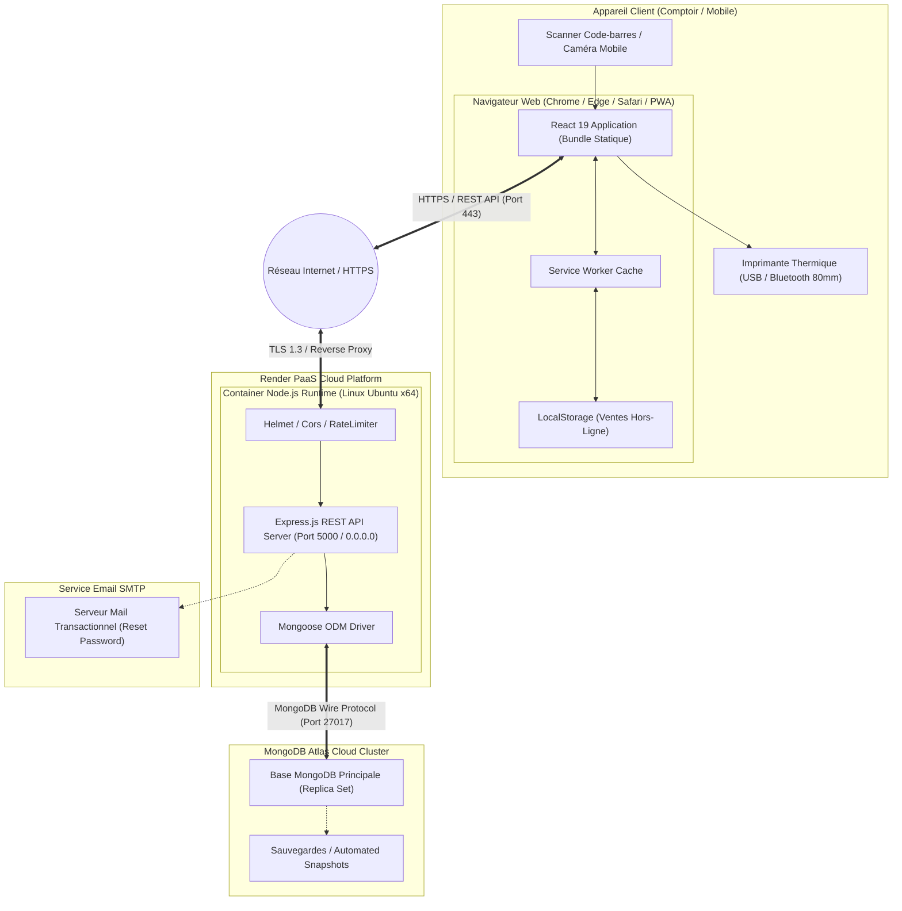

# Diagrammes d'États et de Déploiement (State & Deployment Diagrams)

## Présentation

Ce document rassemble les **Diagrammes de Machine à États** (décrivant le cycle de vie des factures et des stocks) ainsi que le **Diagramme de Déploiement** de la solution **Ice Facture** sur son infrastructure d'exécution Cloud.

---

## 1. Diagramme d'États : Cycle de Vie d'une Facture / Transaction

Ce diagramme illustre les transitions d'état d'une vente, de sa préparation au panier jusqu'à son règlement intégral ou son annulation.

---

## 2. Diagramme d'États : Niveau de Stock d'un Produit

---

## 3. Diagramme de Déploiement (Deployment Diagram)

Ce diagramme décrit la topologie physique et l'hébergement de l'application Ice Facture en environnement de production (Node.js Render Cloud & MongoDB Atlas).

